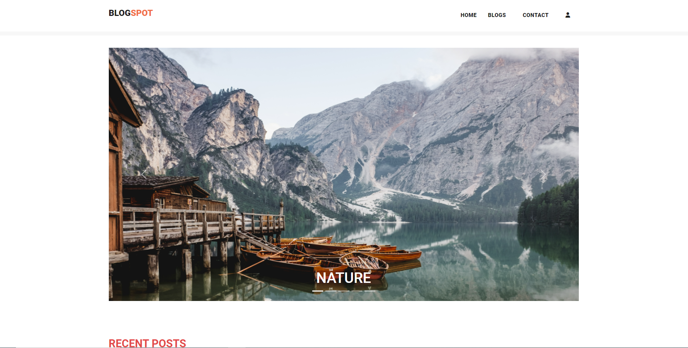
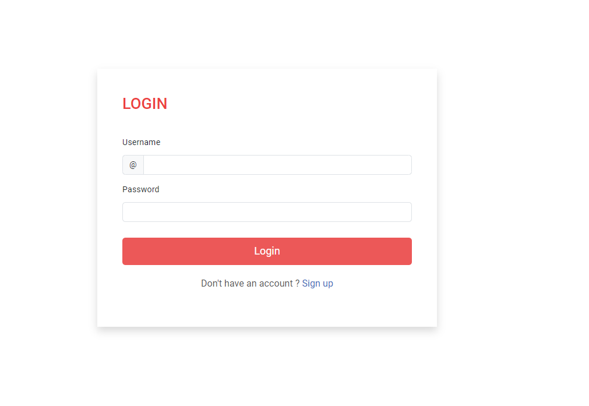
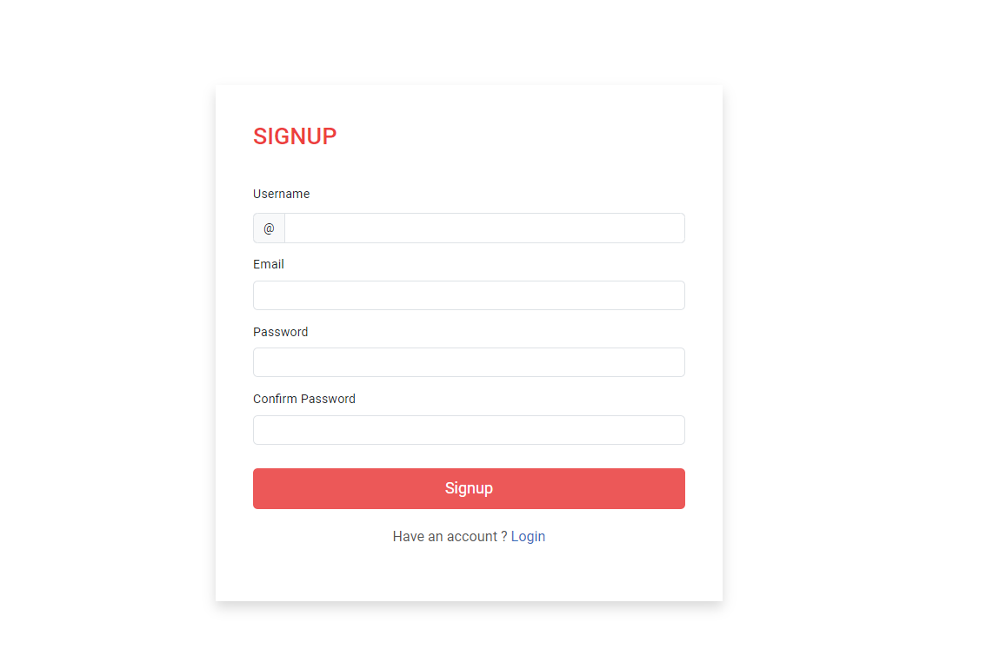

  <h1 align="center">Blog Application</h1>

  <a href="https://blogs-n2mq.onrender.com/"><strong>➥ Live Demo</strong></a>

# Overview

This is a full-stack blog application built as part of the internship assessment for the Full Stack Intern role at Omnify. The application allows users to register, log in, create, view, edit, and delete blog posts. Published blogs are publicly accessible with pagination support.

The project demonstrates user authentication, RESTful API development, frontend-backend integration, and cloud deployment.

---

## Features

- User registration and login with email and password authentication.
- Authenticated users can create, edit, and delete their own blog posts.
- Publicly accessible blog listing with pagination.
- Detailed blog view for each post (publicly accessible).
- Responsive design for desktop and mobile devices.
- Blogs stored in a relational or NoSQL database.
- Backend API built with Django REST Framework.
- Frontend built using React (or your chosen framework).
- Deployed on [Your Cloud Platform] (e.g., AWS / Google Cloud / Azure).

---

## Technology Stack

| Layer          | Technology                                     |
| -------------- | ---------------------------------------------- |
| Frontend       | React.js (or Angular/Vue)                      |
| Backend        | Django REST Framework (or Laravel/Spring Boot) |
| Database       | PostgreSQL / MySQL / MongoDB                   |
| Authentication | JWT / Session-based Authentication             |
| Deployment     | AWS / Google Cloud Platform / Azure            |

---

## Getting Started

### Prerequisites

- Node.js (v14 or higher)
- Python (v3.8 or higher)
- pip
- virtualenv (optional but recommended)
- Git
- [Database software if running locally, e.g., MySQl]

---

### Installation

1. **Clone the repository**

git clone https://github.com/yourusername/your-blog-app.git
cd your-blog-app

2. **Backend Setup**

cd backend
python -m venv env          # Create virtual environment
source env/bin/activate     # Activate virtualenv (Linux/macOS)
# OR
.\env\Scripts\activate      # Activate virtualenv (Windows)

pip install -r requirements.txt  # Install backend dependencies
python manage.py migrate          # Apply database migrations
python manage.py runserver        # Start Django backend server

3. **Frontend Setup**

cd ../frontend
npm install                  # Install frontend dependencies
npm start                    # Start React development server
Access the application

Backend API running on: http://localhost:8000

Frontend running on: http://localhost:3000

4. **API Endpoints**

Endpoint	Method	Description
/api/auth/signup/	POST	Register a new user
/api/auth/login/	POST	Login and receive authentication token
/api/blogs/	GET	Get paginated list of all blogs
/api/blogs/	POST	Create a new blog (authenticated)
/api/blogs/{id}/	GET	Retrieve blog details by ID
/api/blogs/{id}/	PUT	Update a blog (author only)
/api/blogs/{id}/	DELETE	Delete a blog (author only)

**Deployment**
The application is deployed on [Cloud Platform] and can be accessed via:
URL: https://your-app-url.com

**Video Walkthrough**
A short video walkthrough of the project can be viewed here:
[Link to Loom Video]

**Contribution**
This project is developed for internship assessment purposes. Contributions and feedback are welcome.

**License**
[Specify License if any, e.g., MIT License]

**Contact**
For any queries, please contact:
Kishorekumar V
Email: kishorekumarv25@gmail.com

Thank you for reviewing my project!

If you want me to create and save this `.md` file for you to download, just let me know!

**Screenshots**

